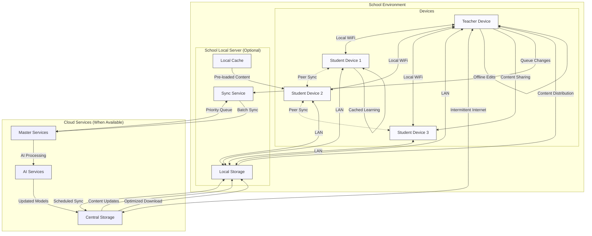
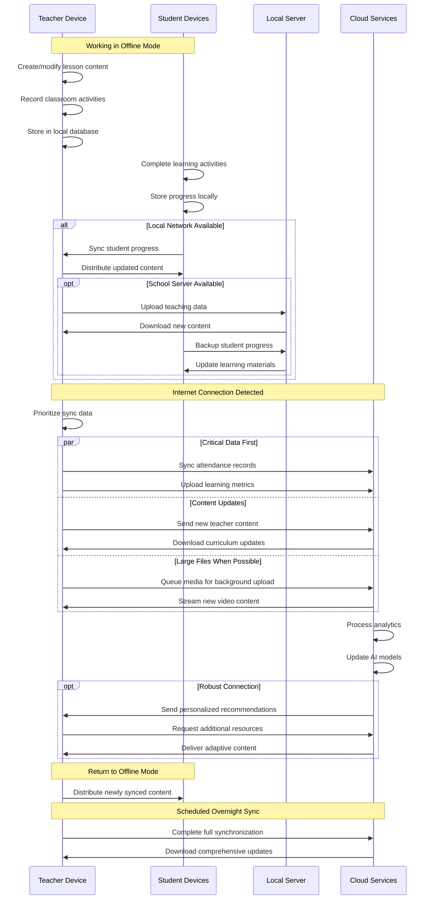
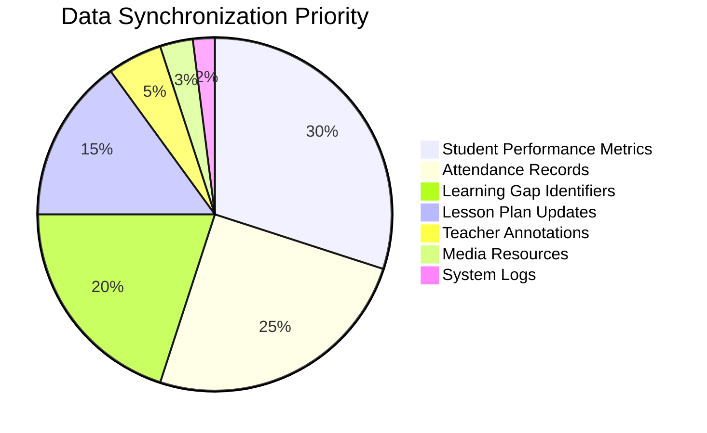

# DronAIcharya Offline Synchronization Mechanism

This diagram illustrates how DronAIcharya manages data and content synchronization in low-connectivity environments.

## Offline-to-Online Synchronization Process

## Data Prioritization for Limited Bandwidth

