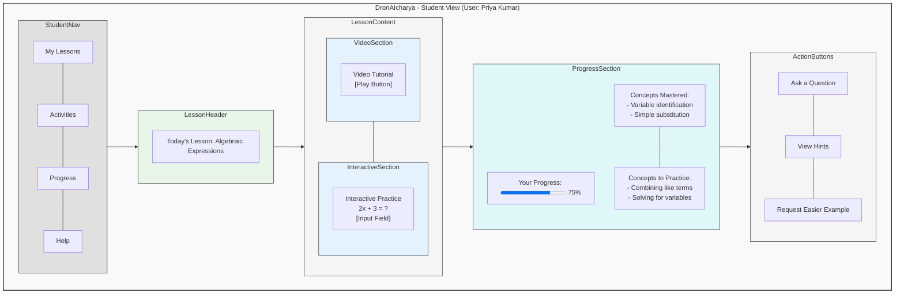
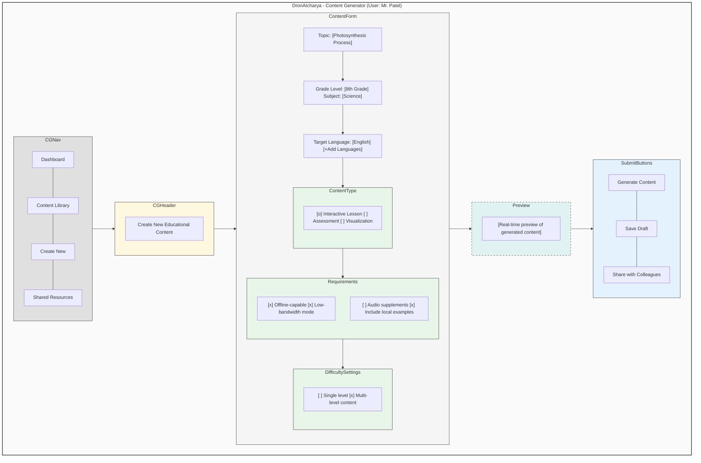

# Wireframes/Mock Diagrams of the Proposed Solution

## Teacher Dashboard Interface

```mermaid
graph TD
    subgraph TeacherDashboard["DronAIcharya Teacher Dashboard"]
        subgraph NavBar
            N1["Dashboard"] --- N2["Students"] --- N3["Content"] --- N4["Analytics"] --- N5["Community"] --- N6["Settings"]
        end
        
        subgraph Header
            H1["Class Overview: 7B Mathematics"] --- H2["Date: 12/09/2023"]
        end
        
        subgraph LeftPanel
            L1[Today's Topics<br>- Algebraic Expressions<br>- Linear Equations]
            L2[Learning Progress<br><progress value=65 max=100></progress> 65%]
            L3[Learning Gaps Detected<br>- 8 students struggling with<br>coefficient multiplication<br>- 5 students need review<br>of variable basics]
        end
        
        subgraph RightPanel
            R1[Real-Time Class Engagement<br><div style='background:#f0f0f0;height:100px;width:200px;text-align:center'>[Heatmap View]</div>]
            R2[Engagement Statistics<br>Engaged: 18 | Struggling: 7 | Idle: 3]
            R3[Recommended Actions<br>- Generate Simplified Examples<br>- Create Visual Explanation<br>- Form Peer Learning Groups<br>- Adapt Current Lesson<br>- Translate to Hindi/Marathi]
        end
        
        subgraph Tools
            T1["Take Attendance"] --- T2["Quiz Generator"] --- T3["Share Screen"] --- T4["Save Offline"]
        end
        
        NavBar --> Header
        Header --> LeftPanel
        Header --> RightPanel
        LeftPanel --- RightPanel
        LeftPanel --> Tools
        RightPanel --> Tools
    end
    
    style TeacherDashboard fill:#f8f8f8,stroke:#333,stroke-width:2px
    style NavBar fill:#e0e0e0,stroke:#333,stroke-width:1px
    style Header fill:#f0f8ff,stroke:#333,stroke-width:1px
    style LeftPanel fill:#f5f5f5,stroke:#333,stroke-width:1px
    style RightPanel fill:#f5f5f5,stroke:#333,stroke-width:1px
    style Tools fill:#e8eaf6,stroke:#333,stroke-width:1px
```

## Student Learning Interface



## Content Generation Flow

