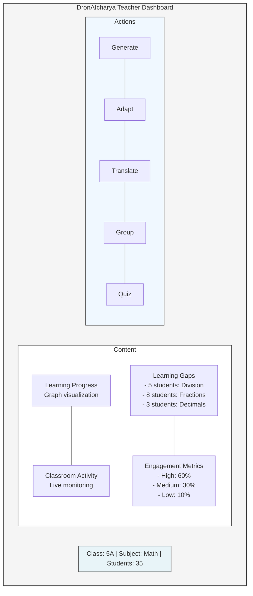
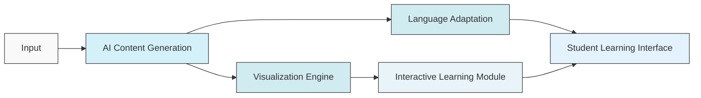
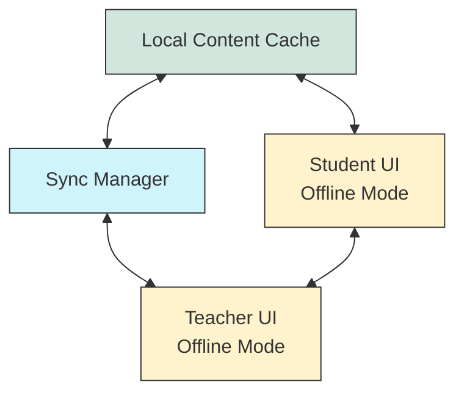

# List of features offered by the solution

- **Adaptive AI Tutoring:** Personalized lesson plans and quizzes.
- **Multilingual Content Adaptation:** Regional language support.
- **Dynamic Interactive Visualizations:** On-demand educational videos and interactive playgrounds.
- **Real-Time Analytics:** Behavior monitoring, attendance tracking, and emotion recognition.
- **Offline Capabilities:** Caching essential content for low-connectivity environments.
- **Teacher Support Tools:** Automated documentation, progress tracking, and peer collaboration.
- **Parental Notifications:** Timely updates on student performance.
- **Ethical AI Transparency:** Clear, understandable AI decision-making processes.

## Visual Representations

### Teacher Dashboard

### Content Generation Flow

### Offline Functionality Architecture

