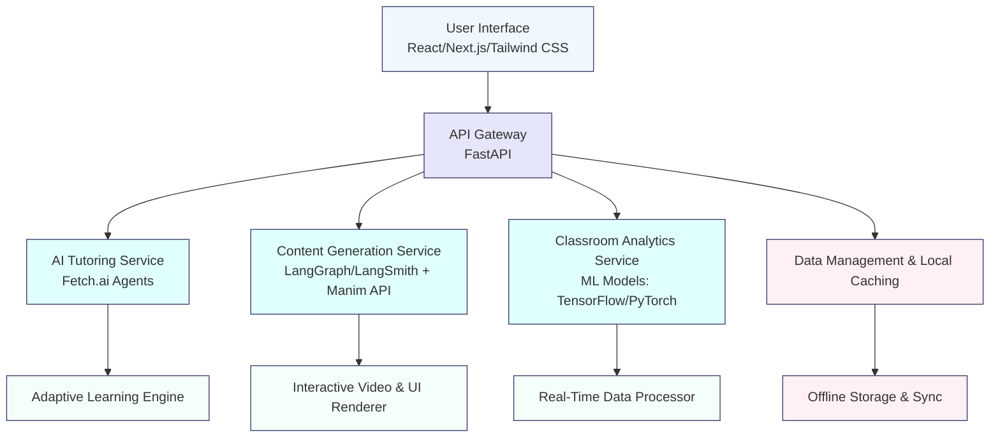
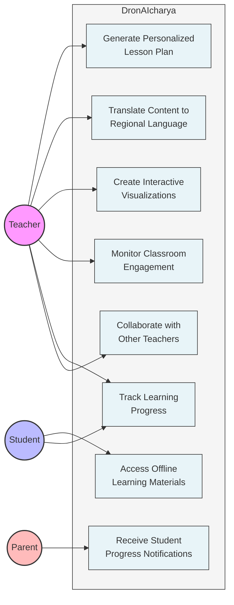

# High-Level Architecture Diagram

```mermaid
flowchart TD
    A[User Interface<br>React/Next.js/Tailwind CSS] --> B[API Gateway<br>FastAPI]
    B --> C[AI Tutoring Service<br>Fetch.ai Agents]
    B --> D[Content Generation Service<br>LangGraph/LangSmith + Manim API]
    B --> E[Classroom Analytics Service<br>ML Models: TensorFlow/PyTorch]
    C --> F[Adaptive Learning Engine]
    D --> G[Interactive Video & UI Renderer]
    E --> H[Real-Time Data Processor]
    B --> I[Data Management & Local Caching]
    I --> J[Offline Storage & Sync]
    
    %% Styling nodes
    style A fill:#f0f8ff,stroke:#336,stroke-width:1px
    style B fill:#e6e6fa,stroke:#336,stroke-width:1px
    style C fill:#e0ffff,stroke:#336,stroke-width:1px
    style D fill:#e0ffff,stroke:#336,stroke-width:1px
    style E fill:#e0ffff,stroke:#336,stroke-width:1px
    style F fill:#f5fffa,stroke:#336,stroke-width:1px
    style G fill:#f5fffa,stroke:#336,stroke-width:1px
    style H fill:#f5fffa,stroke:#336,stroke-width:1px
    style I fill:#fff0f5,stroke:#336,stroke-width:1px
    style J fill:#fff0f5,stroke:#336,stroke-width:1px
```

## Use-Case Diagram

```mermaid
graph LR
    %% Actors
    T((Teacher))
    S((Student))
    P((Parent))
    
    %% Use cases
    subgraph DronAIcharya
        UC1[Generate Personalized<br>Lesson Plan]
        UC2[Translate Content to<br>Regional Language]
        UC3[Create Interactive<br>Visualizations]
        UC4[Monitor Classroom<br>Engagement]
        UC5[Track Learning<br>Progress]
        UC6[Access Offline<br>Learning Materials]
        UC7[Receive Student<br>Progress Notifications]
        UC8[Collaborate with<br>Other Teachers]
    end
    
    %% Relationships
    T --> UC1
    T --> UC2
    T --> UC3
    T --> UC4
    T --> UC5
    T --> UC8
    S --> UC6
    S --> UC5
    P --> UC7
    
    %% Styling
    style T fill:#f9f,stroke:#333,stroke-width:2px
    style S fill:#bbf,stroke:#333,stroke-width:2px
    style P fill:#fbb,stroke:#333,stroke-width:2px
    style DronAIcharya fill:#f5f5f5,stroke:#333,stroke-width:1px
    style UC1 fill:#e8f4f8,stroke:#333,stroke-width:1px
    style UC2 fill:#e8f4f8,stroke:#333,stroke-width:1px
    style UC3 fill:#e8f4f8,stroke:#333,stroke-width:1px
    style UC4 fill:#e8f4f8,stroke:#333,stroke-width:1px
    style UC5 fill:#e8f4f8,stroke:#333,stroke-width:1px
    style UC6 fill:#e8f4f8,stroke:#333,stroke-width:1px
    style UC7 fill:#e8f4f8,stroke:#333,stroke-width:1px
    style UC8 fill:#e8f4f8,stroke:#333,stroke-width:1px
``` 