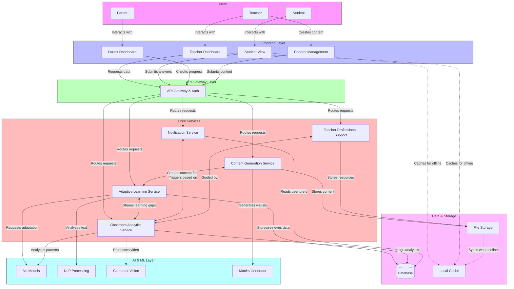
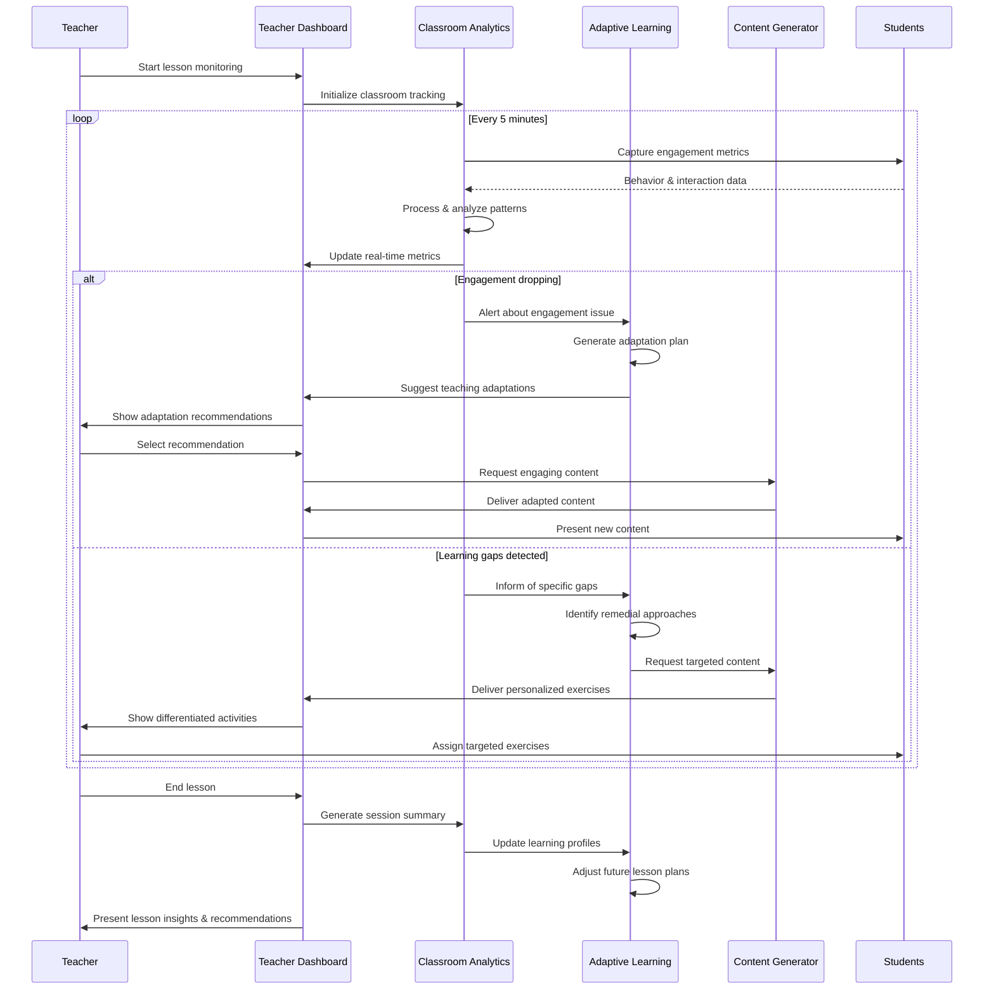

# DronAIcharya System Data Flow

This diagram illustrates how data flows between the different components of the DronAIcharya system, showing the interactions between services and how information is processed.

## Real-time Event Processing Flow

This diagram shows how the system handles real-time classroom events and generates adaptive responses.

